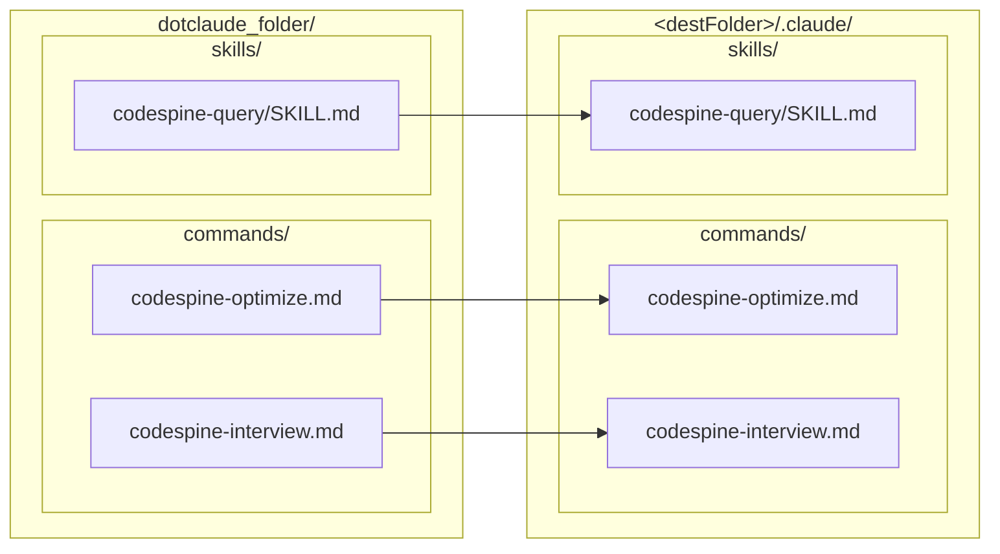

# `install`

Install the bundled [Claude Code](https://claude.com/claude-code) assets — the
`/codespine-optimize` and `/codespine-interview` slash commands and the
`codespine-query` skill — into a project's `.claude/` directory, so an agent can
drive the knowledge graph through the `codespine` CLI. This is the
one-command way to set up the [agent](/agent/slash-commands) in any repository.

Source: [`src/commands/install_command.ts`](https://github.com/jeromeetienne/codespine/blob/main/src/commands/install_command.ts) ·
bundled assets: [`dotclaude_folder/`](https://github.com/jeromeetienne/codespine/tree/main/dotclaude_folder)

## Synopsis

```bash
npx codespine install [destFolder] [options]
```

## Arguments

| Argument | Default | Description |
| --- | --- | --- |
| `[destFolder]` | current directory | Project root to install into; assets land under its `.claude/` directory. |

## Options

| Option | Default | Description |
| --- | --- | --- |
| `--force` | `false` | Overwrite files that already exist. Without it, existing files are left untouched and reported as skipped. |

## What it does

Mirrors every file under the published package's `dotclaude_folder/` into
`<destFolder>/.claude/`, preserving the tree so Claude Code finds each asset where
it expects it:



An existing file is **skipped** (not overwritten) unless `--force` is given, so
re-running is safe and local edits are preserved. The command prints one line per
file — `✓` installed, `✗ skip (exists)` skipped — then a summary.

## Output

```
✓ commands/codespine-optimize.md
✓ commands/codespine-interview.md
✓ skills/codespine-query/SKILL.md

installed 3 file(s) into /…/your-project/.claude
```

Re-running without `--force` once the files exist:

```
✗ skip (exists): commands/codespine-optimize.md
…
installed 0 file(s) into /…/your-project/.claude, skipped 3 (pass --force to overwrite)
```

## Examples

```bash
# install into the current project's .claude/
npx codespine install

# install into a specific project
npx codespine install ../other-project

# refresh to the bundled versions, overwriting local copies
npx codespine install --force
```

## Notes and caveats

- **It only copies assets — it does not build a graph.** After installing, the
  agent still needs a loaded database: `npx codespine extract . --semantic`
  then `npx codespine load`. The slash commands build it on first use if
  it is missing.
- **No API key or provider.** The agent runtime is Claude Code itself, so there is
  nothing else to configure — see [Agent](/agent/slash-commands).
- **In this repository's own checkout**, the assets are already committed under
  `.claude/`; `install` is for getting them into *another* project.

## See also

- [Agent](/agent/slash-commands) — the slash commands and skill this installs.
- [`/codespine-optimize`](/agent/slash-commands) · [`/codespine-interview`](/agent/slash-commands)
  — what you get once it is installed.
