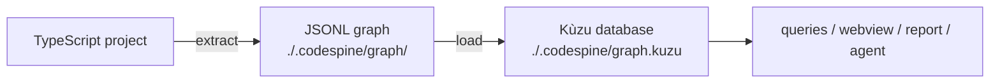

# The pipeline

This guide walks you from a fresh project to an autonomous agent applying its
first verified optimization. Total time: about 10 minutes. If you have not yet,
start with [Install](/getting-started/install).

## What you are building

The pipeline has three stages, each producing an artifact the next one consumes:



1. **extract** — parses a TypeScript project with `ts-morph` (the TS compiler
   API) into nodes (modules, classes, functions, types…) and edges (`CALLS`,
   `IMPORTS`, `USES_TYPE`, `READS`…).
2. **load** — imports the JSONL into an embedded [Kùzu](https://kuzudb.com)
   graph database (no server required).
3. **query / optimize** — traversal commands answer impact-analysis questions;
   the `/codespine-optimize` Claude Code command hands those same queries to an
   agent as tools.

## 1. Extract a graph

Point `extract` at any TypeScript project with a `tsconfig.json`. The examples
below analyze the current directory.

```bash
npx codespine extract . --semantic
```

Expected output — the figures are illustrative and vary with the codebase and
version, so they are shown as a shape rather than exact counts:

```
✓ ~390 nodes, ~1.3k edges -> /…/.codespine/graph

Nodes
  Method           …
  Variable         …
  TypeAlias        …
  …
Edges
  CONTAINS         …
  READS            …
  CALLS            …
  …
```

`--semantic` enables symbol resolution: `CALLS`, `EXTENDS`/`IMPLEMENTS`,
`RETURNS`/`PARAM_TYPE`/`USES_TYPE`, `INSTANTIATES`, and `READS` edges. Without
it you get only the fast structural layer (files, declarations, imports,
containment). For everything in this guide, use `--semantic`.

The result is two line-oriented JSON files you can inspect directly:

```bash
head -n 3 .codespine/graph/nodes.jsonl
head -n 3 .codespine/graph/edges.jsonl
```

See [`extract`](/commands/extract) for every option.

## 2. Load it into the query database

```bash
npx codespine load
```

This writes the embedded Kùzu database to `./.codespine/graph.kuzu` — derived from
`-o, --output-folder` (default `./.codespine`), the same base every other command
reads from.

> **Re-running after code changes:** the loader merges by node id, so stale
> nodes from a previous extraction are not removed. For a clean state, delete
> the database and reload:
> `rm -rf .codespine/graph.kuzu && npx codespine extract . --semantic && npx codespine load`

## 3. Query the graph

Node ids always come from a query — never write them by hand. `find` locates
symbols; add `--json` to get their ids:

```bash
npx codespine find KuzuStore
#   Class          KuzuStore  src/store/kuzu_store.ts:11

npx codespine find KuzuStore --json
#   [{ "id": "ClassDeclaration:src/store/kuzu_store.ts#KuzuStore@11", ... }]
```

Then feed an id into the traversal commands (your line numbers will differ —
ids encode the declaration line, so always copy them from `find --json`):

```bash
# who calls this method, directly?
npx codespine who-calls 'MethodDeclaration:src/store/kuzu_store.ts#run@49'

# everything transitively impacted if I change it (the blast radius)
npx codespine blast-radius 'MethodDeclaration:src/store/kuzu_store.ts#run@49' --depth 10

# every reference to a symbol or type: calls, type usage, heritage, new, value reads
npx codespine references 'TypeAliasDeclaration:src/schema/node.ts#GraphNode@37'

# one-hop neighbourhood, both directions
npx codespine neighbors 'ClassDeclaration:src/store/kuzu_store.ts#KuzuStore@11'

# exported symbols nothing references — dead-code candidates
npx codespine dead-exports
```

Every query accepts `--json` for machine-readable output — the exact shape the
agent consumes. For these commands organised by the analysis question they
answer, see the [Static Analysis guide](/howtos/static-analysis); for each one in
depth, the [Command Reference](/commands/overview).

## 4. Run the optimization agent

The agent ships as a [Claude Code](https://claude.com/claude-code) slash
command, `/codespine-optimize` (see [Agent](/agent/slash-commands)). There is no
provider, API key, or `.env` to configure — the agent runtime is Claude Code
itself. The commands are committed in this repository's `.claude/`; for another
project, install them with `npx codespine install` (see
[`install`](/commands/install)).

**Start from a clean git tree** — the agent edits files, and `git diff` is how
you review what it did. Then, inside Claude Code:

```text
/codespine-optimize
```

With no argument it runs the default mission: find one genuinely dead exported
symbol, prove it has zero inbound references, and remove it. You can direct it
explicitly:

```text
/codespine-optimize Inline the single-use helper formatRow in src/report.ts
```

What happens on each run:

1. The command explores the graph with the read-only query commands
   (`dead-exports`, `references`, `who-calls`, `blast-radius`).
2. It makes exactly one edit with the Edit tool.
3. It runs the [`verify`](/commands/verify) gate (type-check **and** tests).
4. **Pass** → the edit stands. **Fail** → it reverts with `git restore <file>`,
   then retries with a different edit or abandons the change.

It finishes by reporting the file changed, the symbol removed, and why removal
was safe — or that it found no safe change. Review with `git diff`, keep what
you like, `git checkout -- <file>` what you don't.

A read-only companion command, `/codespine-interview`, interviews you to scope
a measurable optimization target and grounds each candidate in the graph,
producing tasks you can then hand to `/codespine-optimize`.

## Troubleshooting

| Symptom | Cause / fix |
|---|---|
| `/codespine-optimize` is not a known command | The commands are not installed into `.claude/`. Run `npx codespine install` (or, inside this repo, `npm run symlink:dotclaude`). |
| Query returns `(no results)` for an id you typed | Ids encode the declaration line (`…@50`) and shift when code changes. Re-run `find` to get the current id — never reuse ids across extractions. |
| `dead-exports` lists a symbol you believe is used | Re-extract + reload first (stale graph). If it persists, check whether the use is dynamic (string-keyed access, reflection) — the graph only sees static references. |
| Kùzu errors about the database directory | Another process may hold the db open, or the db is from an incompatible Kùzu version. `rm -rf .codespine/graph.kuzu` and reload. |
| The agent keeps reverting the edit it tries | Each candidate breaks the verify gate, so the command restores the file. Scope the task to a single named symbol, or steer it toward a clearer dead-code target. |

## Where to go next

- [Browse the Graph](/howtos/explore) — use the interactive visualisation to get
  oriented in an unfamiliar codebase.
- [Static Analysis guide](/howtos/static-analysis) — use the query commands by hand
  to answer impact, dead-code, and dependency questions about a codebase.
- [Optimize Your Code](/howtos/optimize) — the measured loop: profile, find the
  leverage, edit, verify, and benchmark the impact.
- [Concepts](/concepts/graph-model) — the graph model and why a semantic graph.
- [Command Reference](/commands/overview) — every command's arguments, options,
  and underlying query.
- [Agent](/agent/slash-commands) — the optimization agent's find → confirm →
  edit → verify → revert method.

> **Try the whole pipeline on a sample project.** This repository ships four
> guided tours that run nearly every command end to end (extract → load → …
> → enrich → hotspots → cost → verify → benchmark → report):
> `npm run project01:tour` (and `project02:tour` … `project04:tour`).
