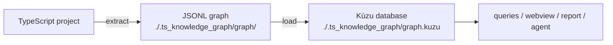

# Le pipeline

Ce guide vous mène d'un projet vierge à un agent autonome appliquant sa
première optimisation vérifiée. Durée totale : environ 10 minutes. Si ce n'est pas déjà fait,
commencez par [Install](/getting-started/install).

## Ce que vous construisez

Le pipeline comporte trois étapes, chacune produisant un artefact que la suivante consomme :



1. **extract** — parse un projet TypeScript avec `ts-morph` (l'API du compilateur
   TS) pour en produire des nœuds (modules, classes, fonctions, types…) et des arêtes (`CALLS`,
   `IMPORTS`, `USES_TYPE`, `READS`…).
2. **load** — importe le JSONL dans une base de données de graphe embarquée [Kùzu](https://kuzudb.com)
   (aucun serveur requis).
3. **query / optimize** — les commandes de parcours répondent aux questions d'analyse d'impact ;
   la commande Claude Code `/code-graph-optimize` confie ces mêmes requêtes à un
   agent en tant qu'outils.

## 1. Extraire un graphe

Pointez `extract` vers n'importe quel projet TypeScript doté d'un `tsconfig.json`. Les exemples
ci-dessous analysent le répertoire courant.

```bash
npx ts-knowledge-graph extract . --semantic
```

Sortie attendue — les chiffres sont indicatifs et varient selon la base de code et la
version, ils sont donc présentés comme un ordre de grandeur plutôt que comme des comptes exacts :

```
✓ ~390 nodes, ~1.3k edges -> /…/.ts_knowledge_graph/graph

Nodes
  Method           …
  Variable         …
  TypeAlias        …
  …
Edges
  CONTAINS         …
  READS            …
  CALLS            …
  …
```

`--semantic` active la résolution des symboles : les arêtes `CALLS`, `EXTENDS`/`IMPLEMENTS`,
`RETURNS`/`PARAM_TYPE`/`USES_TYPE`, `INSTANTIATES` et `READS`. Sans
cela, vous n'obtenez que la couche structurelle rapide (fichiers, déclarations, imports,
contenance). Pour tout ce qui figure dans ce guide, utilisez `--semantic`.

Le résultat est constitué de deux fichiers JSON orientés ligne que vous pouvez inspecter directement :

```bash
head -n 3 .ts_knowledge_graph/graph/nodes.jsonl
head -n 3 .ts_knowledge_graph/graph/edges.jsonl
```

Voir [`extract`](/commands/extract) pour chaque option.

## 2. Le charger dans la base de données de requête

```bash
npx ts-knowledge-graph load
```

Cela écrit la base de données Kùzu embarquée dans `./.ts_knowledge_graph/graph.kuzu` — dérivée de
`-o, --output-folder` (valeur par défaut `./.ts_knowledge_graph`), la même base que toutes les autres commandes
lisent.

> **Réexécution après des changements de code :** le chargeur fusionne par identifiant de nœud, de sorte que les
> nœuds périmés issus d'une extraction précédente ne sont pas supprimés. Pour repartir d'un état propre, supprimez
> la base de données et rechargez :
> `rm -rf .ts_knowledge_graph/graph.kuzu && npx ts-knowledge-graph extract . --semantic && npx ts-knowledge-graph load`

## 3. Interroger le graphe

Les identifiants de nœud proviennent toujours d'une requête — ne les écrivez jamais à la main. `find` localise
les symboles ; ajoutez `--json` pour obtenir leurs identifiants :

```bash
npx ts-knowledge-graph find KuzuStore
#   Class          KuzuStore  src/store/kuzu_store.ts:11

npx ts-knowledge-graph find KuzuStore --json
#   [{ "id": "ClassDeclaration:src/store/kuzu_store.ts#KuzuStore@11", ... }]
```

Fournissez ensuite un identifiant aux commandes de parcours (vos numéros de ligne différeront —
les identifiants encodent la ligne de déclaration, copiez-les donc toujours depuis `find --json`) :

```bash
# who calls this method, directly?
npx ts-knowledge-graph who-calls 'MethodDeclaration:src/store/kuzu_store.ts#run@49'

# everything transitively impacted if I change it (the blast radius)
npx ts-knowledge-graph blast-radius 'MethodDeclaration:src/store/kuzu_store.ts#run@49' --depth 10

# every reference to a symbol or type: calls, type usage, heritage, new, value reads
npx ts-knowledge-graph references 'TypeAliasDeclaration:src/schema/node.ts#GraphNode@37'

# one-hop neighbourhood, both directions
npx ts-knowledge-graph neighbors 'ClassDeclaration:src/store/kuzu_store.ts#KuzuStore@11'

# exported symbols nothing references — dead-code candidates
npx ts-knowledge-graph dead-exports
```

Chaque requête accepte `--json` pour une sortie exploitable par une machine — la forme exacte que
l'agent consomme. Pour ces commandes organisées selon la question d'analyse à laquelle elles
répondent, voir le [guide d'analyse statique](/howtos/static-analysis) ; pour chacune en
détail, la [Référence des commandes](/commands/overview).

## 4. Exécuter l'agent d'optimisation

L'agent est livré sous la forme d'une commande slash [Claude Code](https://claude.com/claude-code),
`/code-graph-optimize` (voir [Agent](/agent/slash-commands)). Il n'y a aucun
fournisseur, aucune clé d'API, ni aucun `.env` à configurer — l'environnement d'exécution de l'agent est Claude Code
lui-même. Les commandes sont versionnées dans le `.claude/` de ce dépôt ; pour un autre
projet, installez-les avec `npx ts-knowledge-graph install` (voir
[`install`](/commands/install)).

**Partez d'un arbre git propre** — l'agent modifie des fichiers, et `git diff` est la manière dont
vous passez en revue ce qu'il a fait. Ensuite, dans Claude Code :

```text
/code-graph-optimize
```

Sans argument, il exécute la mission par défaut : trouver un symbole exporté réellement
mort, prouver qu'il n'a aucune référence entrante, et le supprimer. Vous pouvez le diriger
explicitement :

```text
/code-graph-optimize Inline the single-use helper formatRow in src/report.ts
```

Ce qui se passe à chaque exécution :

1. La commande explore le graphe avec les commandes de requête en lecture seule
   (`dead-exports`, `references`, `who-calls`, `blast-radius`).
2. Elle effectue exactement une modification avec l'outil Edit.
3. Elle exécute le contrôle [`verify`](/commands/verify) (vérification de types **et** tests).
4. **Réussite** → la modification est conservée. **Échec** → elle revient en arrière avec `git restore <file>`,
   puis réessaie avec une autre modification ou abandonne le changement.

Elle termine en signalant le fichier modifié, le symbole supprimé et pourquoi la suppression
était sûre — ou qu'elle n'a trouvé aucun changement sûr. Passez en revue avec `git diff`, conservez ce que
vous aimez, et utilisez `git checkout -- <file>` pour ce que vous n'aimez pas.

Une commande compagne en lecture seule, `/code-graph-interview`, vous interroge pour cadrer
une cible d'optimisation mesurable et ancre chaque candidat dans le graphe,
produisant des tâches que vous pouvez ensuite confier à `/code-graph-optimize`.

## Dépannage

| Symptôme | Cause / correctif |
|---|---|
| `/code-graph-optimize` n'est pas une commande connue | Les commandes ne sont pas installées dans `.claude/`. Exécutez `npx ts-knowledge-graph install` (ou, dans ce dépôt, `npm run symlink:dotclaude`). |
| Une requête renvoie `(no results)` pour un identifiant que vous avez saisi | Les identifiants encodent la ligne de déclaration (`…@50`) et se décalent lorsque le code change. Réexécutez `find` pour obtenir l'identifiant actuel — ne réutilisez jamais des identifiants d'une extraction à l'autre. |
| `dead-exports` liste un symbole que vous croyez utilisé | Réextrayez + rechargez d'abord (graphe périmé). Si cela persiste, vérifiez si l'usage est dynamique (accès par clé sous forme de chaîne, réflexion) — le graphe ne voit que les références statiques. |
| Erreurs Kùzu au sujet du répertoire de la base de données | Un autre processus maintient peut-être la base ouverte, ou la base provient d'une version de Kùzu incompatible. Exécutez `rm -rf .ts_knowledge_graph/graph.kuzu` et rechargez. |
| L'agent ne cesse de revenir sur la modification qu'il tente | Chaque candidat fait échouer le contrôle verify, la commande restaure donc le fichier. Cadrez la tâche sur un seul symbole nommé, ou orientez-la vers une cible de code mort plus claire. |

## Où aller ensuite

- [Parcourir le graphe](/howtos/explore) — utilisez la visualisation interactive pour vous
  repérer dans une base de code inconnue.
- [Guide d'analyse statique](/howtos/static-analysis) — utilisez les commandes de requête à la main
  pour répondre à des questions d'impact, de code mort et de dépendances au sujet d'une base de code.
- [Optimiser votre code](/howtos/optimize) — la boucle mesurée : profiler, trouver le
  levier, modifier, vérifier, et mesurer l'impact par benchmark.
- [Concepts](/concepts/graph-model) — le modèle de graphe et pourquoi un graphe sémantique.
- [Référence des commandes](/commands/overview) — les arguments, options et
  requête sous-jacente de chaque commande.
- [Agent](/agent/slash-commands) — la méthode trouver → confirmer →
  modifier → vérifier → revenir en arrière de l'agent d'optimisation.

> **Essayez l'ensemble du pipeline sur un projet d'exemple.** Ce dépôt fournit quatre
> visites guidées qui exécutent presque chaque commande de bout en bout (extract → load → …
> → enrich → hotspots → cost → verify → benchmark → report) :
> `npm run project01:tour` (et `project02:tour` … `project04:tour`).
