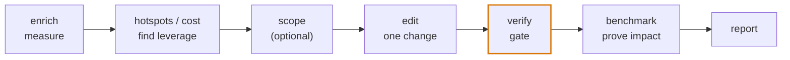

# Optimiser votre code

Ce guide présente la **boucle d'optimisation mesurée** : utiliser le graphe pour trouver où une
base de code passe réellement son temps, changer une seule chose, et prouver — avec une barrière stricte,
et non une intuition — que le changement est sûr et qu'il a aidé. C'est le pendant du
[guide d'analyse statique](/howtos/static-analysis) : celui-ci répond à des questions *structurelles*
à la main ; celui-ci boucle de la *mesure* vers une *modification
vérifiée*.

La même boucle pilote l'agent [`/codespine-optimize`](/agent/slash-commands).
Que vous l'exécutiez vous-même ou que vous la confiiez à l'agent, la forme est identique :



Deux règles maintiennent la boucle honnête :

- **`verify` est la barrière, pas le benchmark.** Le résultat de la vérification de types + des tests décide
  du maintien ou de l'annulation. Un écart de benchmark est *consultatif* — une médiane bruitée qui peut suggérer
  mais jamais autoriser un changement.
- **Mesurez avant de couper.** Sans profil, le graphe peut vous montrer la *structure*
  (ce qui est central) mais pas le *coût* (ce qui est chaud). Enrichissez d'abord, sinon vous devinez.

## Mise en place : construire, puis enrichir

L'optimisation a besoin d'un graphe porteur d'un poids d'exécution. Construisez-le
([Premiers pas](/getting-started/pipeline) en présente la marche à suivre complète), puis
attachez-y un profil.

```bash
# 1. build the semantic graph
npx ts-knowledge-graph extract . --semantic
npx ts-knowledge-graph load

# 2. record a V8 CPU profile while the code runs a representative workload
node --cpu-prof --cpu-prof-dir ./.ts_knowledge_graph/prof ./run-workload.js

# 3. attach the measured self-time onto graph nodes (metadata.runtime)
npx ts-knowledge-graph enrich ./.ts_knowledge_graph/prof/*.cpuprofile --root .
```

`enrich` rattache chaque trame profilée à la déclaration à laquelle elle appartient et rapporte
la **couverture** — la fraction du temps profilé qui s'est posée sur un nœud du graphe.
Une faible couverture (la majeure partie du temps passé dans des dépendances ou du code natif) signifie que les
classements dans le projet ci-dessous ne décrivent qu'une tranche du coût réel ; `enrich` le dit clairement.

> Les projets d'exemple câblent tout cela ensemble : `npm run project01:enrich` exécute un
> script de profilage et d'enrichissement pour vous, et `npm run project01:tour` parcourt toute la
> boucle de bout en bout.

## 1. Trouver le levier

**Question :** parmi tout ce qui compose cette base de code, qu'est-ce qui vaut la peine d'être optimisé ?

Classez par temps propre mesuré — le temps passé *dans un nœud lui-même*, la seule chose qu'une
réécriture locale peut supprimer :

```bash
npx ts-knowledge-graph hotspots --by self-time
```

```
 1.       142 ms  Method     titleCase        src/text/string_utils.ts:48
 2.        91 ms  Function   normalizeWhitespace  src/text/string_utils.ts:12
 …
```

[`hotspots`](/commands/hotspots) classe le levier ; sans profil, il se rabat
sur `--by callers` (fan-in statique) et vous le signale. Les autres métriques —
`call-count`, `blast-radius` — font remonter différents types de levier.

Le temps propre vous dit *où le temps est passé* ; [`cost`](/commands/cost) vous dit
*qui en est responsable*. Le coût inclusif est le temps propre d'un nœud plus tout ce
qu'il appelle transitivement, de sorte qu'une fonction qui paraît bon marché mais en appelle une coûteuse
se classe quand même haut :

```bash
npx ts-knowledge-graph cost                 # rank the whole graph by inclusive cost
npx ts-knowledge-graph cost "$ID"           # break one node into callee/caller attribution
```

La vue d'attribution est celle à lire avant de modifier : elle montre quelle part du
coût d'un nœud s'écoule vers chaque appelé (où couper) et quelle part chaque appelant
porte (qui ressent le changement).

## 2. Cadrer une cible réelle (facultatif)

**Question :** j'ai un souhait vague (« rendre cela plus rapide ») — quelle est la tâche concrète et
mesurable ?

La commande en lecture seule [`/codespine-interview`](/agent/slash-commands) transforme une
dimension (latence, mémoire, coût, taille du bundle…) en une tâche de référence et de cible
ancrée dans de vrais identifiants de nœuds, et vous la rend. Utilisez-la quand l'objectif est flou ;
sautez-la quand vous connaissez déjà le symbole.

## 3. Effectuer exactement une modification

Changez une seule chose — à la main, ou laissez [`/codespine-optimize`](/agent/slash-commands)
appliquer une unique modification vérifiée sûre. Avant de toucher un symbole chaud, confirmez son
rayon d'impact par la voie statique ([`references`](/commands/references),
[`who-calls`](/commands/who-calls), [`blast-radius`](/commands/blast-radius)) afin de
savoir exactement ce qu'un changement préservant le comportement doit laisser intact.

Gardez la modification petite et préservant le comportement. Plus le rayon d'impact est petit, plus l'étape
suivante est facile à approuver en confiance.

## 4. La verrouiller avec `verify`

**Question :** la modification a-t-elle conservé un code correct ?

```bash
npx ts-knowledge-graph verify --cwd .
```

[`verify`](/commands/verify) exécute les scripts `typecheck` et `test` du projet et
renvoie **un** verdict maintien/annulation. `ok: true` → la modification tient ; `ok: false` →
annulez-la (`git restore <file>`) et essayez-en une autre. Lorsqu'il n'y a pas de script de test, il
se rabat sur la seule vérification de types et le signale honnêtement — une passe limitée à la vérification de types n'est
**pas** une garantie de comportement. C'est la barrière stricte ; rien de ce qui suit ne la supplante.

## 5. Confirmer l'impact avec `benchmark`

**Question :** la modification a-t-elle réellement rendu cela plus rapide ?

```bash
npx ts-knowledge-graph benchmark titleCase \
  --workload ./bench/title_case_workload.ts --runs 5
```

[`benchmark`](/commands/benchmark) profile la cible sur N exécutions et rapporte la
**médiane + la dispersion**. Enregistrez une référence avant la modification et comparez après :

```bash
# before the edit
npx ts-knowledge-graph benchmark titleCase --workload … --save-baseline
# after the edit
npx ts-knowledge-graph benchmark titleCase --workload … --baseline
#   Δ vs baseline  -57 ms  (-40.1%)  improved
```

Lisez l'écart par rapport à la dispersion : un changement plus petit que la dispersion d'une exécution à l'autre est
du bruit, pas un résultat. Le benchmark est **consultatif** — il vous informe, il ne supplante jamais
le verdict de `verify` de l'étape 4.

## 6. Prendre un instantané avec `report`

Bouclez la boucle avec un relevé partageable de l'état des choses :

```bash
npx ts-knowledge-graph report
```

[`report`](/commands/report) écrit un `CODEBASE_BRIEF` dont la section Runtime reflète désormais
votre graphe enrichi et postérieur à la modification — un avant/après que vous pouvez comparer ou transmettre.

## Ce que cette boucle peut et ne peut pas promettre

- **`verify` ne prouve la sûreté que dans la mesure où les tests vont.** Une barrière au vert sur une
  suite mince est une garantie faible ; la boucle rapporte les passes limitées à la vérification de types comme *non*
  vérifiées du point de vue comportemental plutôt que de les enjoliver.
- **`benchmark` est une mesure, pas une promesse.** Les médianes dérivent avec la charge de la machine.
  Traitez un écart inférieur à la dispersion comme « aucun changement mesurable », et préférez une charge de travail qui
  reflète la production.
- **Le graphe voit la structure de coût statique, les profils voient le coût dynamique.** Les points chauds et
  le coût ne sont représentatifs que dans la mesure où l'est la charge de travail que vous avez profilée — enrichissez avec
  une charge réaliste, et surveillez le nombre de couverture.

## Voir aussi

- [`hotspots`](/commands/hotspots) · [`cost`](/commands/cost) ·
  [`enrich`](/commands/enrich) · [`benchmark`](/commands/benchmark) ·
  [`verify`](/commands/verify) · [`report`](/commands/report) — les commandes que cette
  boucle enchaîne.
- [Agent](/agent/slash-commands) — `/codespine-optimize` exécute cette boucle
  de façon autonome ; `/codespine-interview` cadre la cible.
- [Analyse statique](/howtos/static-analysis) — le pendant structurel, piloté à la main.
- [Parcourir le graphe](/howtos/explore) — orientez-vous avant d'optimiser.
