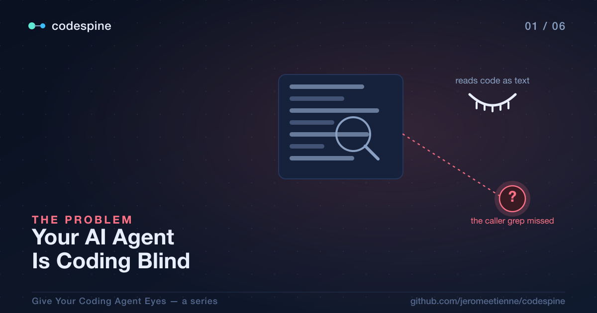

# Your AI Agent Is Coding Blind

This project started with a headhunter.

They reached out wanting to talk about a role centered on a specific idea:
optimizing code automatically, with AI. Before the interview I did what I always
do when I want to actually understand a problem instead of just talking about it
— I started building a prototype. The plan was modest: spend a few evenings
getting a feel for what "an AI that optimizes your code" would really take, so I
could speak about it from experience rather than hand-waving.

About two weeks later I had something genuinely interesting on my hands. Not the
quick demo I'd set out to build — something that had forced me to confront a
problem I hadn't expected to be the hard part at all. That prototype is the
project this series is about. It's called
[codespine](https://github.com/jeromeetienne/codespine), and the problem it
exists to solve is the subject of this first post.

Here's the wall I hit early. I'd ask the agent to make a small change — rename a
function, tighten its signature, update the callers. It would write the new
version perfectly: clean diff, good naming, even improved the JSDoc. Then it
would go looking for the callers, find three, update them, declare victory, and
hand control back to me.

The build was broken.

There was a fourth caller. It reached the function through a re-export and a type
alias, so the name the agent had searched for never appeared at that call site.
The agent didn't miss it because it was careless. It missed it because it was
looking the only way it knew how: it was reading the code as *text*.

I kept hitting versions of that same wall. And it became clear that you can't
build an agent that *optimizes* code until you've solved a more basic problem:
the agent can't reliably see what its edits will break. That's what this first
post is about. No installation steps yet — just the problem. The rest of the
series is how codespine fixes it.

> The complete project is open source: [repository](https://github.com/jeromeetienne/codespine)



## The Thing Your Agent Reaches For

Ask any coding agent — Claude Code, Cursor, Cline, whatever you drive — "is this
function used anywhere?" and watch what it does. It greps. It searches for the
name, skims the matches, opens a couple of files, builds a small mental map of
who depends on what, and acts on that map.

You know this move, because it's *your* move. It's the one every engineer has
made ten thousand times. The difference is that when you do it, a lifetime of
scar tissue is running in the background: *wait, isn't this also re-exported from
the barrel file? didn't we alias this type somewhere?* You hesitate. You check
the index. You catch the fourth caller because some part of you remembers it
exists.

The agent has no scar tissue. It has a regex and a confident disposition. So it
does the risky thing faster and with less doubt than you would, and then it
applies the edit.

## Why Text Search Can't Answer the Question

Here is the uncomfortable part: grep was never the right tool for this, for any
of us. It just happened to be the one always within reach.

The questions we ask before touching code are not textual questions. "Who calls
this?" "What breaks if I change this type?" "Is this export actually dead, or is
it referenced somewhere I'm not looking?" None of those are about where a string
appears. They're about *relationships* — a call from one function to another, a
type flowing into a parameter, an interface implemented three files away.

Text search is blind to all of it in both directions:

- **It misses real connections.** A caller that reaches your function through a
  re-export, an aliased import, or a destructured namespace doesn't contain the
  name you searched for. Grep walks right past it. That's the fourth caller.
- **It invents fake ones.** A local variable that happens to share a name. The
  same identifier in an unrelated module. A mention inside a comment or a string
  literal. Grep reports them all with equal confidence, and now your agent is
  reasoning about callers that don't exist.

Consider what's actually going on in a few lines of perfectly ordinary
TypeScript:

```ts
// money.ts
export function formatAmount(cents: number): string { /* … */ }

// index.ts  — the barrel
export { formatAmount as formatPrice } from './money';

// checkout.ts
import { formatPrice } from './index';
const label = formatPrice(total);   // a real caller of formatAmount…
```

A search for `formatAmount` finds the declaration and nothing else. The one place
that genuinely depends on it calls it `formatPrice`, through a barrel, from
another file. To a human reading carefully, the chain is followable. To grep, the
caller is invisible. To an agent that trusts grep, the function looks safe to
change — right up until the build fails.

The information needed to answer the question correctly *is in the code*. It's
just stored in a far richer form than text, and we keep flattening it back into
text to search it.

## Why This Is More Dangerous in a Machine

When *you* build a fragile mental map from a grep and act on it, there's a whole
quiet apparatus catching your mistakes. You move slower on code you don't
recognize. You feel a twinge of doubt and double-check. A reviewer who knows that
corner of the system raises an eyebrow. The map is fragile, but it sits inside a
person who knows it's fragile.

An agent removes every one of those brakes:

- **It doesn't slow down on unfamiliar code.** It moves at the same confident
  pace everywhere, including the parts where you'd have hesitated.
- **It doesn't feel the doubt.** "I found three callers and updated them" is
  stated with exactly the same certainty whether or not a fourth exists.
- **It acts.** This is the real shift. A human with a bad mental map proposes a
  change. An agent with a bad mental map *applies* it, then moves on to the next
  task built on top of the broken one.

Every time an agent edits a real codebase, it is — whether it knows it or not —
making a bet about blast radius. Today that bet is backed by a text search. We've
handed the fastest, most confident, least doubtful actor in the building the
weakest possible way of knowing what its actions will break.

## Code Isn't Text. We Just Keep Storing It That Way.

Step back from grep and look at what's actually in front of the agent.

A function calls another function. A module imports another module. A class
extends a base and implements an interface. A type flows out of a return, into a
parameter, through a dozen call sites. None of those facts are textual. They are
directed, typed, meaningful *relationships*.

Lay them all out and you don't get a list of file-and-line matches. You get a
graph:

```
         imports                 calls                 extends
Module ───────────▶ Module   Function ──────▶ Function   Class ──────▶ Class
   │                              │                          │
   │ contains                     │ uses-type                │ implements
   ▼                              ▼                          ▼
 Class                          TypeAlias                 Interface
```

That graph is already latent in every codebase you have. The TypeScript compiler
resolves it in full every time it type-checks — it knows that `formatPrice` in
`checkout.ts` is `formatAmount` in `money.ts`, because it followed the alias and
the re-export to the real declaration. The knowledge exists. We just never hand
it to the agent. We hand it grep instead.

So the question that runs underneath this entire series is simple:

> What if the agent could ask the graph the question it's actually asking —
> *"who really calls this?"* — and get the resolved, symbol-level answer the
> compiler already knows, instead of a pile of string matches?

That answer doesn't include `formatAmount` matched literally three times. It
includes the one real caller, named `formatPrice`, reached through the barrel —
the exact one grep missed and the build found.

## Where This Goes

You don't fix a blind agent by writing better prompts or reminding it to "be
careful." Carefulness isn't the missing ingredient; *eyes* are. The agent needs a
view of your code that's built from resolved symbols and types, not from text —
something it can query the way the compiler queries it, so that "who calls this?"
returns a fact instead of a guess.

That's what [codespine](https://github.com/jeromeetienne/codespine) is: it parses
your TypeScript into exactly that graph and exposes it as tools your agent can
call. You keep talking to your agent the way you already do — you never touch the
tooling yourself. The agent gains the ability to *look things up* instead of
guessing, and to prove an edit is safe before it makes it.

In the [next post](./02_your_first_code_graph.article.md) we make this concrete.
I install codespine, point my agent at a real project, and ask it the same "who
calls this?" question that started this whole mess — except this time the answer
comes from resolved symbols, the fourth caller shows up, and the build stays
green.

The agent was never bad at writing code. It was just doing it with its eyes
closed. Let's open them.
