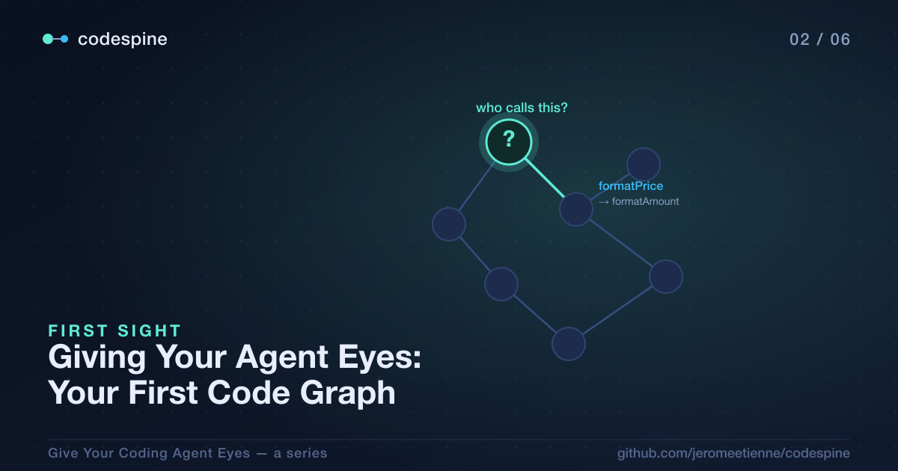

# Giving Your Agent Eyes: Your First Code Graph

In the [last post](./01_your_ai_agent_is_coding_blind.article.md) I left the agent
mid-failure: asked to rename a function, it found three callers, missed a fourth
that reached the function through a re-export and a type alias, and broke the
build. The diagnosis was that it was reading the code as text, and "who calls
this?" is not a text question.

This post is where that stops. By the end of it, I ask the agent the same
question that broke the build — and the fourth caller shows up, because the agent
is no longer guessing from string matches. It's reading a graph.

The whole thing takes about five minutes, and after the one setup step you'll
notice something: I never open a terminal again. I just talk to the agent.

> The complete project is open source: [repository](https://github.com/jeromeetienne/codespine)



## The One Command You Run Yourself

codespine ships as a set of tools your agent calls — a skill and a couple of
commands. To put those tools where your agent can find them, you install them
once into the project:

```bash
npx codespine install
```

That's the only time in this entire series you touch the command line directly.
It drops the codespine skill and commands into the project so the agent can reach
them. From here on, every box that looks like a shell command is something *the
agent* runs on your behalf — I show them so you can see what it's doing under the
hood, not so you type them.

## Then You Just Ask

With the tools installed, I went back to the exact situation from Post 1. I had a
function, `formatAmount`, and I wanted to know — really know, not grep-know — who
depended on it before I let the agent touch it. So I asked, in plain English:

> *Before you rename `formatAmount`, who actually calls it?*

Here's what the agent did. It didn't grep. It recognized this as a question about
code structure and reached for the codespine tools instead. Under the hood, that
meant three steps.

First, it built a graph of the project from the TypeScript source:

```bash
codespine extract . --semantic
```

`extract` parses the project with the TypeScript compiler API — not a regex, the
actual compiler — and writes out every symbol and every relationship between
symbols. The `--semantic` flag is the important part: it turns on symbol
resolution, so the graph knows that an aliased, re-exported call is still a call
to the original function. The result is two plain text files, one symbol or
relationship per line, that you could read with your eyes if you wanted to.

Second, it loaded that graph into a local database it can query:

```bash
codespine load
```

This reads the files from the previous step into an embedded
[Kùzu](https://kuzudb.com) graph database. "Embedded" means there's no server to
run and nothing to configure — it's a file on disk, the same way SQLite is. The
agent now has a queryable map of the codebase sitting next to the code.

Third — and this is the one that matters — it asked the graph the question:

```bash
codespine who-calls <formatAmount> --json
```

And the answer came back with the caller that grep had missed in Post 1: the one
in `checkout.ts` that reaches `formatAmount` through the barrel file under the
name `formatPrice`. Not matched by text — *resolved* by symbol. The agent now
knew about all the callers, including the fourth, before it changed a single
character.

I didn't run any of that. I asked a question in English; the agent translated it
into extract → load → who-calls and translated the result back into an answer.
The renaming went fine. The build stayed green.

## What Just Happened, in Three Nouns

It's worth slowing down on the pipeline, because the same three artifacts show up
in every post after this one:

```
TypeScript project ──extract──▶ graph files ──load──▶ Kùzu database ──▶ the agent's queries
```

- **extract** turns source code into a graph: nodes for the things in your code
  (modules, classes, functions, types) and edges for the relationships between
  them (`CALLS`, `IMPORTS`, `EXTENDS`, `USES_TYPE`, and more). This is the step
  that uses the real compiler, which is why it can follow the alias grep choked
  on.
- **load** puts that graph into an embedded database so it can be traversed
  quickly — "start at this function, walk the `CALLS` edges, tell me who I reach."
- **the queries** are how the agent actually uses it: small, precise questions
  like *who calls this*, *what does this reference*, *is this dead*.

You don't memorize any of this. The agent does the translating. But knowing the
shape helps you trust the answers — when the agent says "four callers," you know
it walked resolved `CALLS` edges in a graph, not skimmed a list of string matches.

## The Part That Makes This Portable

I drove all of this through Claude Code, because that's where codespine's skill
and commands live most comfortably. But nothing about the graph is Claude-specific.

Look again at that third step:

```bash
codespine who-calls <formatAmount> --json
```

Every query command takes `--json` and answers with plain, structured data —
ids, names, file paths, relationships. That's the entire integration surface. Any
agent that can run a command and read JSON can use codespine: Cursor, Cline, a
script you wrote yourself, whatever you drive. The graph doesn't care who's
asking. It just answers the question, the same way, every time.

So when I say "the agent" in the posts ahead, read it as *your* agent. The
demonstrations happen to run in Claude Code; the capability is JSON in, JSON out,
and it's available to anything.

## Try It on Your Own Code

Here's your first win, and it's a question worth asking before you let any agent
loose on a refactor. Install the tools once:

```bash
npx codespine install
```

Then hand your agent a prompt like this:

> *Using codespine, map every caller of `<the function you're about to change>`.
> I want the resolved callers, including any that reach it through a re-export or
> an aliased import — not just text matches.*

Watch what comes back. If your codebase has any barrel files, namespace imports,
or aliased re-exports — and most do — there's a good chance the agent surfaces a
caller you'd have missed, the same way it would have missed mine.

That's the foundation. The agent can now *see* who depends on what. In the
[next post](./03_what_breaks_if_i_change_this.article.md) we turn that from a
single lookup into something stronger: the agent proving the full blast radius of
a change — and proving a "dead" export is actually dead — before it touches your
code.
