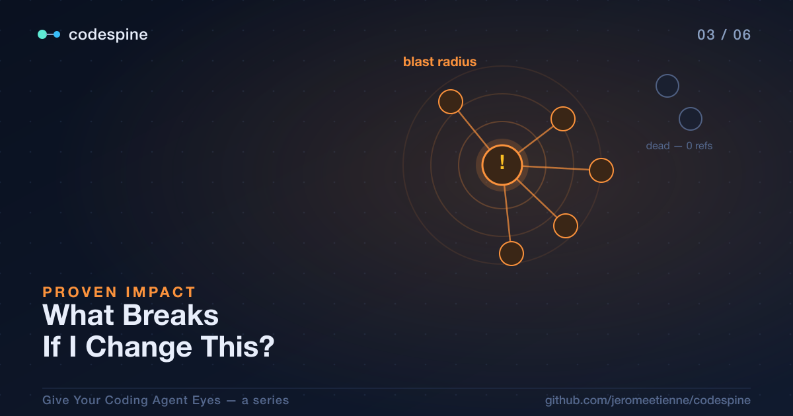

# "What Breaks If I Change This?"

The [last post](./02_your_first_code_graph.article.md) got the agent to answer one
question honestly: *who calls this function?* It walked resolved `CALLS` edges
instead of grepping, and the caller hiding behind a re-export finally showed up.

But "who calls this?" is only the first hop. Real changes ripple. If I rewrite a
function, it's not just the direct callers I care about — it's *their* callers,
and the callers above them, all the way up until the change can't reach any
further. And the opposite question matters just as much: not "what depends on
this?" but "does *anything* depend on this — can I just delete it?"

This post is about those two questions, because they're where an agent earns
trust. An agent that can *prove* the impact of a change before it makes one is a
different kind of collaborator than one that guesses and apologizes.

> The complete project is open source: [repository](https://github.com/jeromeetienne/codespine)



## One Hop Is Not Enough

Picture the change from the last post going one level deeper. I'm not renaming
`formatAmount` anymore — I'm changing what it returns. That's a behavioral change,
and it doesn't just affect whoever calls `formatAmount` directly. It affects
whoever calls *them*, and so on.

This is the **blast radius**: the full set of code that transitively depends on
the thing you're about to touch. A single `who-calls` gives you one ring of it. To
trust a change, the agent needs the whole set.

So I asked:

> *I'm about to change what `formatAmount` returns. Show me the full blast radius
> — everything that could be affected, not just the direct callers.*

Under the hood the agent walked the call graph transitively:

```bash
codespine blast-radius <formatAmount> --depth 10 --json
```

`blast-radius` starts at a symbol and follows the dependency edges outward,
collecting everything it reaches within the given depth. The answer isn't a guess
about "probably these files" — it's the actual reachable set, computed from
resolved edges. When the agent reports back "this change touches these eleven
functions across four files," that number came from a graph traversal, and you
can ask it to show its work.

That changes the conversation. Instead of *"I think this is safe,"* the agent can
say *"here is exactly what this reaches, and here is why."* You're no longer
trusting its confidence. You're checking its evidence.

## "Is Anything Still Using This?"

The other direction is the one that gets agents into the most trouble: deletion.

"This export looks unused, I'll remove it" is the single most dangerous sentence
an agent can say, because text search makes *unused* look easy and it absolutely
is not. An export reached through a barrel, used only as a type, referenced by an
interface three files away, read as a value but never called — grep declares all
of these dead. Delete one and you find out at build time, or worse.

So codespine has a query built specifically for this, and the agent leans on it
before it deletes anything:

```bash
codespine dead-exports --json
```

This finds exported symbols that genuinely have no inbound references. The word
"genuinely" is carrying real weight, and it's worth unpacking, because it's the
difference between a tool an agent can trust and one it can't.

## Why the Dead-Code Answer Is Actually Trustworthy

A dead-code detector is only useful to an agent if it almost never cries wolf.
Think about why: the agent is going to *act* on this answer. If the tool reports
twenty "dead" exports and three of them are actually live, the agent deletes three
things that mattered. One false positive poisons the whole feature. An imprecise
dead-code tool is worse than none, because it converts the agent's caution into
confident destruction.

So codespine's `dead-exports` is deliberately conservative in the ways that
matter:

- **It's member-aware.** A class or interface counts as alive if *any* of its
  members is referenced. It won't tell the agent a class is dead because the class
  name itself is never written — it checks whether anything inside it is used.
- **It counts every kind of use, not just calls.** A symbol is live if it's
  called, extended, implemented, used as a type, returned, taken as a parameter
  type, instantiated, or read as a value. That last one matters a lot in
  TypeScript: an exported `const` schema that's never "called" but is referenced
  as a value is alive, and a naive tool would wrongly flag it.

Here's the concrete result, on codespine's own codebase: `dead-exports` reports
exactly two symbols — two genuinely unused type aliases — and nothing else. No
false positives. When the agent asks "what can I safely delete?", it gets back a
short, true list, not a pile of suspects it has to second-guess. *That* is what
makes the answer safe to act on.

## Trust Is the Whole Point

Step back and notice what these queries have in common. None of them make the
agent smarter at writing code — it was already good at that. What they do is let
the agent *check itself*:

- Before changing behavior, it can pull the full blast radius and show you the
  reachable set.
- Before deleting code, it can confirm the export is truly unreferenced, with a
  query precise enough that a clean result means clean.
- Before editing a type, it can ask `references` what flows through it.

Each of these replaces a bet with a lookup. The agent stops saying "I'm fairly
sure this is safe" and starts saying "here's the evidence that it is." You can
verify the evidence, or you can let it proceed knowing the evidence exists. Either
way you're not relying on its disposition anymore.

This is also the moment the relationship flips. In Post 1 the agent was the
fastest, most confident actor in the building with the weakest way of knowing what
it would break. Give it these queries and that same speed and confidence are now
backed by a precise model of impact. The thing that made it dangerous is what
makes it useful.

## Try It on Your Own Code

Pick the function you'd be most nervous to change — the one with tendrils
everywhere, the one you suspect half the codebase leans on. Ask your agent:

> *Using codespine, give me the full blast radius of `<that function>` before I
> touch it: everything transitively affected, grouped by file. Then separately,
> run a dead-exports check and tell me which exports are genuinely safe to delete.*

Two things tend to happen. The blast radius is either reassuringly small (and now
you know, instead of fearing) or alarmingly large (and now you know *that*,
before you've broken it). And the dead-exports list is short and real — the stuff
you can actually clean up without a second guess.

The agent can now see who depends on what, and prove it. In the
[next post](./04_the_loop_that_cant_lie.article.md) we let it act on that
knowledge: make exactly one change, verify it didn't break anything, and keep it
only if the proof holds — the loop that can't lie about whether an edit is safe.
