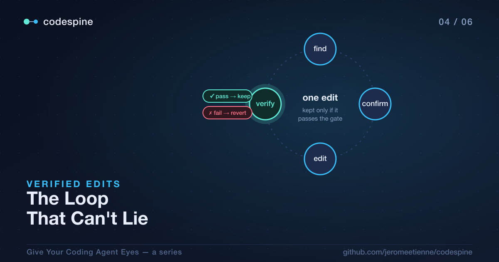

# The Loop That Can't Lie

So far the agent has been *looking*. It can see who calls a function
([Post 2](./02_your_first_code_graph.article.md)), and it can prove the blast
radius of a change and confirm an export is genuinely dead
([Post 3](./03_what_breaks_if_i_change_this.article.md)). All of that is
read-only. Nothing has actually changed your code yet.

This is the post where the agent acts. And acting is where the original problem
comes all the way back: an agent that *edits* with a bad model of consequences is
dangerous precisely because it's fast and confident. So the question isn't just
"can the agent make a change?" — it obviously can. The question is: **can it make
a change and be unable to lie to you about whether the change was safe?**

That's the loop this post is about.

> The complete project is open source: [repository](https://github.com/jeromeetienne/codespine)



## The Smallest Honest Unit of Work

Remember the role that started this whole thing: automatically optimizing code
with AI. When I actually tried to build that, I learned quickly that the failure
mode isn't bad edits — it's *unverified* edits piling up. An agent that makes
twenty changes and tells you they're all fine has given you twenty things to
check by hand. That's not automation; it's a code review you didn't ask for.

So codespine's optimization loop is built around the smallest honest unit of work:
**exactly one change, fully verified, before anything else happens.** In Claude
Code that loop is a single command you give your agent:

```text
/codespine-optimize
```

With no argument, it runs a deliberately modest default mission: find one export
that's genuinely dead, confirm it has zero inbound references, remove it, and
prove the removal didn't break anything. You can also point it at something
specific:

```text
/codespine-optimize Inline the single-use helper formatLabel
```

Either way, the agent runs the same four-step loop — and the fourth step is the
one that makes the difference.

## Find → Confirm → Edit → Verify

Here's the loop, and what the agent is leaning on at each step:

1. **find** — it uses the graph to locate a candidate. For the default mission
   that's `dead-exports` from the last post: the short, true list of genuinely
   unreferenced exports.
2. **confirm** — before touching anything, it double-checks the candidate against
   the graph: `references`, `who-calls`, `blast-radius`. This is the
   self-checking from Post 3, now used as a gate rather than a report. If the
   "dead" export turns out to have a caller, the candidate is dropped here.
3. **edit** — it makes *exactly one* change. Not a sweep. One.
4. **verify** — and this is the part that can't be faked.

## What "Verify" Actually Means

It would be easy, and useless, for the agent to "verify" a change by looking at it
and deciding it seems fine. That's just confidence again, dressed up. So codespine
defines verification as something the agent can't talk its way around:

```bash
codespine verify
```

`verify` runs the project's **type-check and its test suite as a single
keep-or-revert gate.** Not one or the other — both, together, as one pass/fail.

And the consequence is mechanical, not advisory:

- **If verify passes, the edit stands.**
- **If verify fails, the edit is reverted** — `git restore` — and the change is
  abandoned or retried.

Read that again, because it's the whole thesis of the post. The agent does not get
to keep a change it can't verify. Its confidence is irrelevant to the outcome. The
type-checker and the tests decide, and a failure doesn't produce an apology — it
produces a clean working tree, exactly as if the agent had never tried.

This is why I call it the loop that can't lie. The agent *can* be wrong — it can
pick a bad candidate, write a broken edit, misjudge the blast radius. What it
*can't* do is hand you a broken change and call it done. The gate is between the
edit and the keep, and the agent doesn't control the gate.

## Honest About Its Own Limits

There's a failure mode that worried me: what if the project has no tests? A lesser
tool would quietly run the type-check, pass, and report "verified" — implying a
behavioral guarantee it never actually checked.

codespine doesn't do that. On a project with no test script, `verify` degrades to
type-check-only, and it *says so*. The agent tells you the change was type-checked
but not behaviorally verified, rather than letting you believe the tests passed
when there were no tests. An honest "I couldn't fully verify this" is worth far
more than a confident "verified" that means less than you think.

One practical note that follows from all this: run the loop on a clean git tree.
The agent's safety net is `git restore`, so you want the only uncommitted changes
to be the ones it's making — that way you can review exactly what it kept, and
throw it away with a checkout if you disagree.

## From One Edit to a Campaign

One verified edit is the honest unit. But you didn't come here to delete one dead
export — you want the agent to actually *work through* the codebase. The trick is
to scale without giving up the thing that made a single edit trustworthy.

codespine does it in two moves.

First, **scoping**. A vague wish like "optimize this" isn't actionable, and an
agent that acts on a vague wish makes vague messes. So there's a read-only
interview the agent can run to turn the wish into concrete, measurable tasks, each
one anchored to a real symbol in the graph:

```text
/codespine-interview
```

It changes nothing. It produces a list of grounded tasks — *this* function, *that*
dead export — that you can then hand to the optimization loop.

Second, **a de-risked worklist**. codespine can rank the safe wins — the genuinely
dead removals, the high-leverage hotspots — into an ordered campaign:

```text
/codespine-campaign
```

A campaign is just the single-edit loop, run many times, with the discipline kept
intact. The agent takes the worklist one item at a time. For each one it runs the
full find → confirm → edit → verify loop. **If verify passes, the edit stays. If
it fails, that item is reverted and skipped — not retried into a mess, not
allowed to block the next item.** At the end you don't get a pile of changes and a
shrug; you get a ledger: what it applied, what it skipped, and why.

That's the part I find genuinely useful. The campaign can run unattended and the
worst case is bounded — every kept change passed the same gate the single edit
did, and every change that couldn't pass was thrown away cleanly. Scaling up the
volume didn't scale up the risk, because the gate never moved.

## Try It on Your Own Code

This one you run on a clean working tree so you can review what it keeps. Commit
or stash whatever you're working on, then give your agent the modest version
first:

```text
/codespine-optimize
```

Let it find one genuinely dead export, remove it, and verify the removal. Watch
it confirm against the graph before editing, and watch it run the type-check and
tests as the gate. Then look at the single diff it kept and decide if you agree.

If you don't drive Claude Code, the same loop is available to any agent: the moves
are `dead-exports` to find, `references`/`blast-radius` to confirm, one edit, then
`codespine verify` as the keep-or-revert gate. The discipline lives in the
commands, not in the model.

When you're comfortable with one edit, scale it up with `/codespine-campaign` and
read the ledger it hands back.

The agent can now see, prove, *and* act — without being able to lie about whether
the acting was safe. In the
[next post](./05_making_the_graph_causal.article.md) we give it one more sense:
not just what the code *is*, but what it actually *costs* at runtime — so "optimize
this" stops meaning "guess" and starts meaning "measure."
