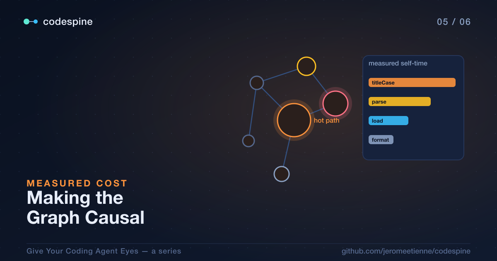

# Making the Graph Causal: Optimize What Actually Costs

By the [last post](./04_the_loop_that_cant_lie.article.md) the agent could see,
prove, and act — make one change and be unable to lie about whether it was safe.
But there's a word in the project's origin I've been quietly dodging:
*optimize.* The headhunter's question wasn't "can an AI safely edit code." It was
"can an AI make code **faster**." And so far the agent has no idea what fast even
means here.

Everything up to now has been *structural*. The graph knows what calls what, what
depends on what, what's dead. That's enough to refactor and delete safely. It is
not enough to optimize, because structure can't tell you what matters. A function
called from two hundred places might run in a microsecond and never matter. A
function called from one place might be where your program spends half its life.
The graph, as built so far, can't tell those two apart.

This post is about giving the graph that missing sense: not just what the code
*is*, but what it actually *costs* when it runs.

> The complete project is open source: [repository](https://github.com/jeromeetienne/codespine)



## Why "Optimize This" Is a Trap

Ask an agent to "make this faster" with only a structural view and watch what it
does. It optimizes what *looks* expensive — a nested loop, a big function, code
that's syntactically busy. Sometimes it's right. Often it spends real effort
speeding up a function that was never on the hot path, ships a more complicated
version of code that didn't matter, and the program runs exactly as fast as
before.

That's the same disease as Post 1, in a new organ. There, the agent guessed at
*structure* because it could only see text. Here, it guesses at *cost* because it
can only see structure. In both cases the fix is the same: stop guessing, give it
the real data.

For cost, the real data is a measurement of the program actually running.

## Teaching the Graph What Ran

You profile the program — a normal V8 CPU profile, the kind you'd capture for any
performance work. That profile is a record of where time actually went: which
functions were on the stack, how often, for how long. codespine takes that profile
and folds it back onto the graph:

```bash
codespine enrich
```

`enrich` reads the CPU profile and attaches measured runtime onto the graph's
nodes — self-time, sample counts — by matching each frame in the profile to the
node whose source range encloses it. After this step, a function node doesn't just
know who calls it; it knows how much time the program spent inside it.

It also reconstructs something the static graph never had: a **runtime call
layer**. The static `CALLS` edges say what *could* call what. The runtime layer
says what *actually fired*, dynamic dispatch and all — the calls that really
happened on this run, which a static parser can't always resolve. That's the
difference between a map of every road and a record of the route you actually
drove.

This is what I mean by making the graph *causal*. It stops being a model of
structure and becomes a model of consequence: this is where the cost is, and this
is what caused it.

## Ranking by What Matters

Once the graph knows cost, "where should I optimize?" becomes a query instead of a
hunch:

```bash
codespine hotspots --by self-time --json
```

`hotspots` ranks nodes by optimization leverage — and when the graph has been
enriched, it ranks by *measured self-time*: the functions where the program
genuinely spent its time, hottest first. That's the list worth handing an agent.
Not "this looks heavy," but "the program spent 18% of its time here."

There's a nice graceful-degradation detail: if you *haven't* enriched, `hotspots`
falls back to static signals like fan-in — a reasonable guess in the absence of
measurement. But once there's a profile, it uses the truth. The agent optimizes
the top of a measured list instead of the top of its imagination.

And there's a companion query for the other half of the question — not "where is
the time spent" but "where does this node's cost *come from*":

```bash
codespine cost <id> --json
```

`cost` reports inclusive cost and share-of-total, and for a given node it shows
where that cost goes and who causes it. That's the causal view: you can follow an
expensive node down to what's actually making it expensive, instead of staring at
a number with no explanation.

## Reporting Impact by Its Number, Not Its Vibe

Here's where it closes the loop with Post 4. The `verify` gate from last post
answers a yes/no question: *did this change break anything?* It's a hard gate —
pass and the edit stands, fail and it's reverted. But "did it break anything" is
not the same question as "did it actually help." A change can be perfectly correct
and do nothing for performance.

So there's a separate tool for the second question:

```bash
codespine benchmark <id>
```

`benchmark` measures a target node's runtime metric — it profiles, enriches, and
reads the cost — over several runs, and reports the **median plus the spread**.
The spread matters: performance numbers are noisy, and a tool that reports a
single triumphant number is hiding that noise from you. By reporting median and
spread, it tells you honestly whether a delta is real or within the jitter.

That turns an optimization claim from a vibe into a measurement. Instead of "I
made `titleCase` faster," the agent can report something like *"−57% self-time on
`titleCase`, measured."* A number you can check, with the noise shown, not an
adjective.

One important distinction: `benchmark` is **advisory**, deliberately separate from
the hard `verify` gate. Correctness is non-negotiable, so it's a gate that reverts
on failure. Performance is a measurement you reason about, so it's reported, not
enforced. Keeping them separate is the honest design — the agent never gets to
quietly trade correctness for speed, and it never gets to claim a speedup it
didn't measure.

## The Full Picture

Stack this post on the last one and the optimization the headhunter asked about
finally has all its pieces:

- **Find what's worth optimizing** — `hotspots` on an enriched graph, ranked by
  measured self-time, so effort goes where the time actually is.
- **Understand why it's expensive** — `cost`, following the causal chain down to
  the real source.
- **Change it safely** — the find → confirm → edit → `verify` loop from Post 4,
  so correctness is a hard gate.
- **Prove it helped** — `benchmark`, reporting a measured median delta with its
  spread, so the win is a number and not a claim.

None of those steps is the agent being clever. Each one is the agent looking
something up that it would otherwise have guessed.

## Try It on Your Own Code

This is the one that tends to surprise people about their own codebase. Capture a
CPU profile of your program doing something representative — a real workload, a
test run, whatever exercises the code you care about — and then ask your agent:

> *Enrich the codespine graph with this profile, then show me the top hotspots by
> measured self-time. For the worst one, trace where its cost comes from. Don't
> optimize anything yet — I just want to see where the time actually goes.*

The list almost never matches your intuition. The function you were sure was the
problem is often cool, and some unremarkable helper is quietly eating the clock.
That gap — between where you *think* the time goes and where it *actually* goes —
is exactly the gap an agent optimizing on structure alone falls into.

The graph now knows structure *and* cost. In the
[final post](./06_seeing_your_codebase.article.md) we make all of it visible:
the webview, the communities codespine detects in your code, and the live demos
you can open in a browser without installing a thing.
