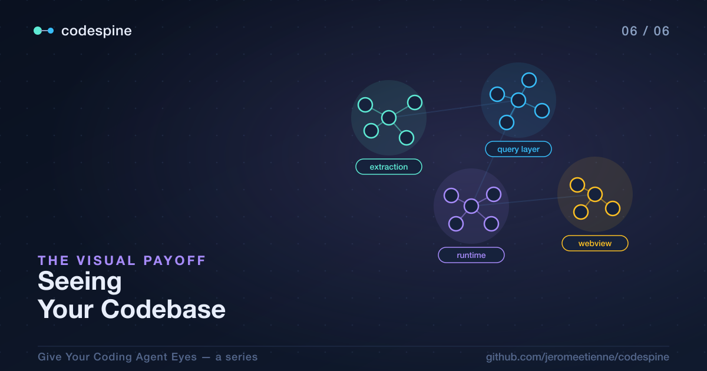

# Seeing Your Codebase: The Webview and Communities

Everything so far has been for the agent. The graph, the queries, the verified
loop, the runtime cost — all of it built so a machine could see your code instead
of guessing at it. This last post is for *you*.

Because here's the thing about a knowledge graph: once it exists, it's not only
useful to an agent. It's the most honest picture of your codebase you've ever had
— built from resolved symbols and real call edges, not from folder names or your
memory of how things fit together. And there's no reason that picture should stay
locked inside a database the agent queries. You should be able to look at it.

So the final piece of codespine is the one you actually see with your own eyes.

> The complete project is open source: [repository](https://github.com/jeromeetienne/codespine)



## Your Codebase as a Map

The same graph the agent has been querying can be served as an interactive map of
your code:

```bash
codespine webview
```

That opens a browser view of the whole graph — every module, class, function, and
type as a node, every call, import, and type relationship as an edge. You can
pan and zoom around it, filter by kind, search for a symbol and jump to it, and
click any node to see exactly what it connects to. It's the structure from Post 1
— the graph that was always latent in your code — finally made visible.

And if you enriched the graph with a profile back in
[Post 5](./05_making_the_graph_causal.article.md), the view carries that too:
the runtime hotspots show up right alongside the structure. You're not looking at
an abstract diagram of what *could* run. You're looking at your codebase with the
expensive parts marked — the same measured truth the agent optimizes against, now
something you can see at a glance.

This is the part that tends to land emotionally. People know their codebase as a
list of files and a mental model that's always a little out of date. Seeing it as
a connected shape — with the dense clusters, the lonely nodes, the surprising
bridge between two modules you thought were unrelated — is a different kind of
understanding.

## Letting the Code Organize Itself

A big graph, though, is a hairball. Tens of thousands of edges don't explain
themselves just by being drawn. So codespine does one more thing before you look:
it finds the natural structure in the graph and groups the code into communities.

```bash
codespine cluster
```

`cluster` runs the **Leiden algorithm** over a weighted version of your code's
coupling graph — functions that call each other, types used together, modules that
lean on one another get pulled into the same community. The result is a set of
clusters that reflect how your code is *actually* wired, which is often not how
your folders are organized.

The reason it's Leiden specifically and not the more common Louvain is a quality
guarantee worth a sentence: Leiden guarantees every community it produces is
internally connected. Louvain can hand you a "community" whose members aren't
actually linked to each other — a cluster that isn't really a cluster. For a view
you're going to trust to understand your code, that guarantee matters.

So now the map isn't a uniform hairball. It's grouped into regions that mean
something.

## Names, Written by Something That Read the Code

A cluster is still just a numbered blob until someone says what it *is*. And this
is a lovely place to close the loop on the whole series, because the thing that
names them is an agent reading the graph — the same capability every prior post
was building toward.

```text
/codespine-name-communities
```

This reads each community's members — the actual functions, types, and modules
that landed in each cluster — and writes back a concise, human-readable label for
it. "Graph extraction." "Runtime enrichment." "The query layer." The names come
from what the code in each cluster actually does, because the thing writing them
just read it.

Now the map is fully legible: your codebase, grouped into real communities, each
one named for what it does, with the runtime-hot parts marked. That's a picture
you can hand a new teammate, or use to find your own bearings in a corner of the
system you've been avoiding.

## See It Without Installing Anything

Here's the part I'd point a skeptic at first, because it asks nothing of you.

Every example codebase that ships with codespine is published as a live, fully
interactive graph — community detection and runtime hotspots already baked in.
You don't install, clone, or run a thing. You open a browser tab and start
exploring someone else's codebase as a graph:

- [**text-kit**](https://jeromeetienne.github.io/codespine/webview_01/) — a string
  utility library
- [**calc**](https://jeromeetienne.github.io/codespine/webview_02/) — a small
  calculator
- [**api-brief**](https://jeromeetienne.github.io/codespine/webview_03/) — an API
  service
- [**shop-sqlite**](https://jeromeetienne.github.io/codespine/webview_04/) — a
  shop backed by SQLite

Open one, filter by kind, search for a function, click it, and watch its real
connections light up. That's the entire thesis of this series in a browser tab:
code is a graph, and once you can see it as one, both you and your agent
understand it in a way grep never allowed.

## The Whole Arc, in One Breath

This started with a headhunter asking whether an AI could optimize code
automatically, and a prototype I built to find out. Two weeks in, the surprise was
that the hard part wasn't the optimizing — it was that the agent couldn't *see*.
The series has been the path out of that:

1. The agent was **coding blind**, reading code as text and guessing at
   consequences.
2. We gave it a **graph** built from resolved symbols, so "who calls this?" became
   a fact.
3. It learned to **prove impact** — blast radius and genuine dead code — before
   touching anything.
4. It started to **act inside a loop that can't lie**: one change, verified by
   type-check and tests, kept only if the proof holds.
5. We made the graph **causal**, so "optimize this" meant *measure*, not guess.
6. And now the whole thing is **visible** — to the agent that queries it and to
   you, looking at it.

Every step removed a guess and replaced it with a lookup. That's the entire idea.
An agent that writes code well was never the hard problem; an agent that *knows
what its edits will do* is, and a knowledge graph is how you give it that.

## Start Here

If you want your own agent to stop coding blind, the on-ramp is a single setup
step from [Post 2](./02_your_first_code_graph.article.md):

```bash
npx codespine install
```

Then talk to your agent the way you already do — ask it who calls a function, ask
it for a blast radius before a refactor, ask it to find and verify one safe
optimization, ask it where your real runtime cost is. It'll reach for the graph
instead of grep, and you'll see the difference in the first answer.

And when you want to *show* someone why it matters,
[open one of the live demos](https://jeromeetienne.github.io/codespine/webview_01/)
and let them click around. The picture makes the argument better than I can.

codespine is open source at
[github.com/jeromeetienne/codespine](https://github.com/jeromeetienne/codespine).
Point it at your codebase and give your agent its eyes.
